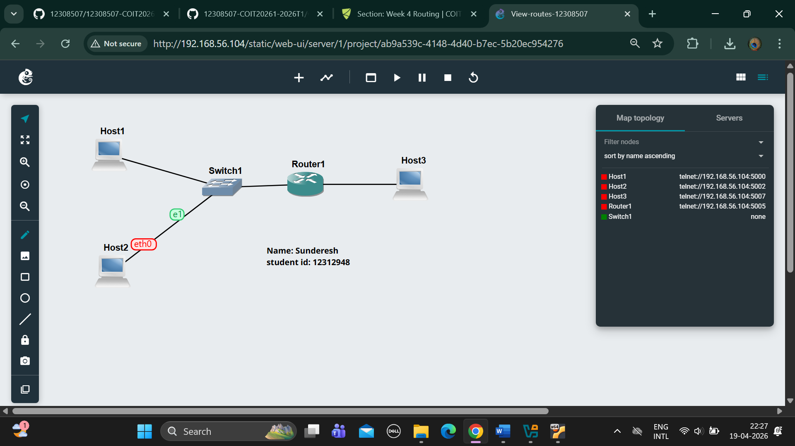
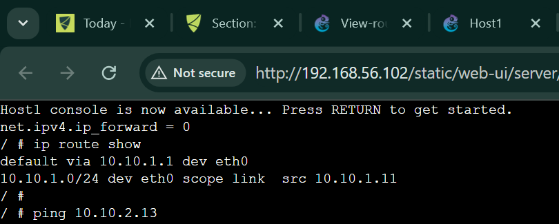

# Outputs:-

1. Exported project

2. Screenshot of the network

3. Record of the IP addresses and routing tables of each host and router.

4.Screenshot of a successful ping from a host one one subnet to a host on the other subnet.
![successful ping]
