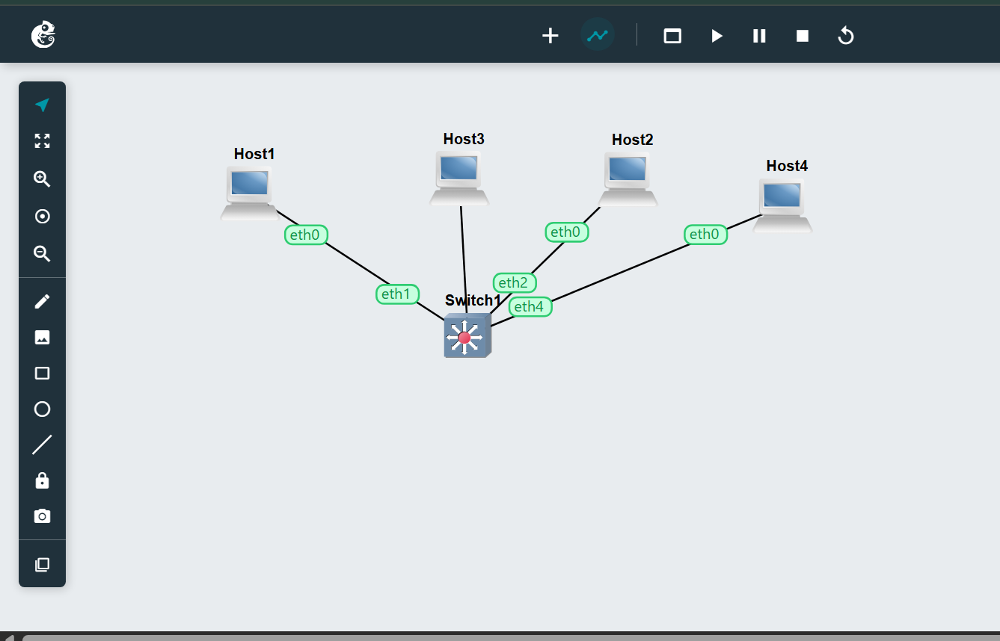
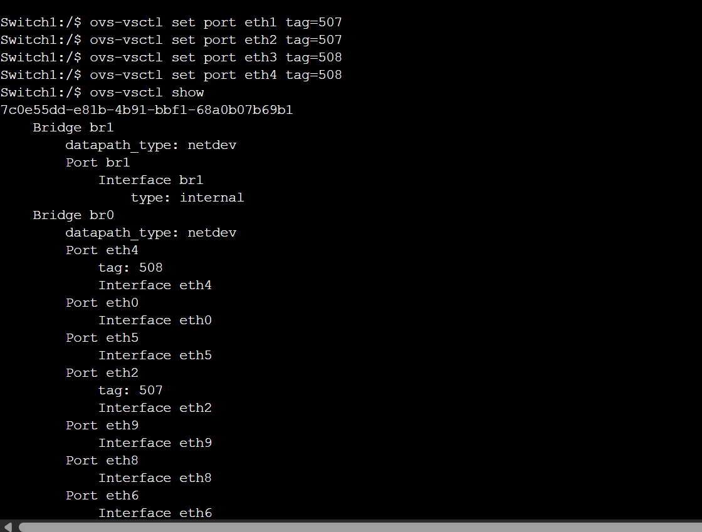
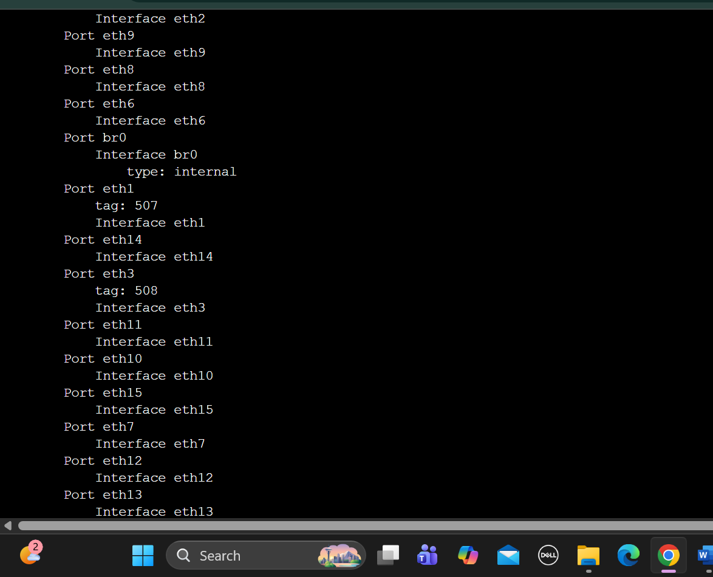
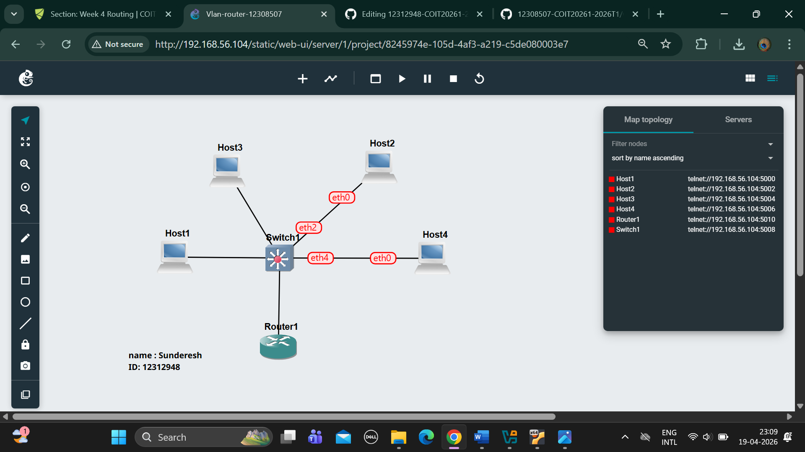
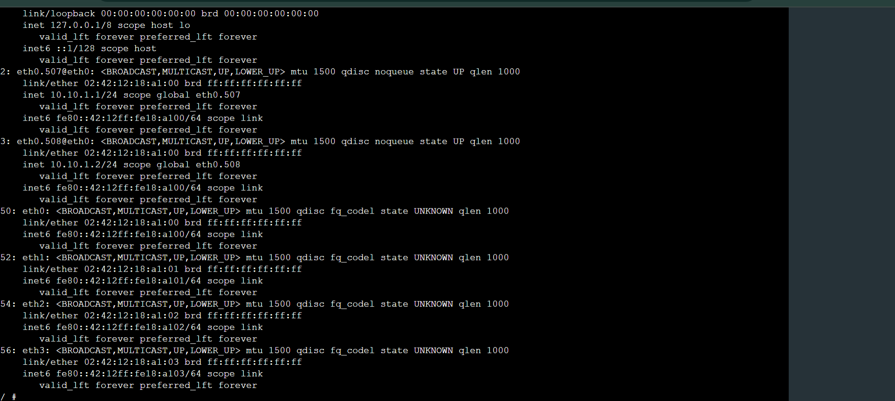

# WEEK5

1.	Exported project:-

2.	Screenshot of the network:-

   
  
3.	Screenshot showing the ports and tags on the switch:-

1.	Exported project

.gns3project)

2.	Screenshot of the network

3.	Screenshot showing the ports and tags on the switch 

