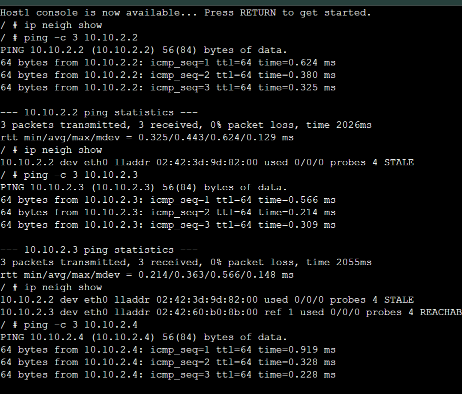
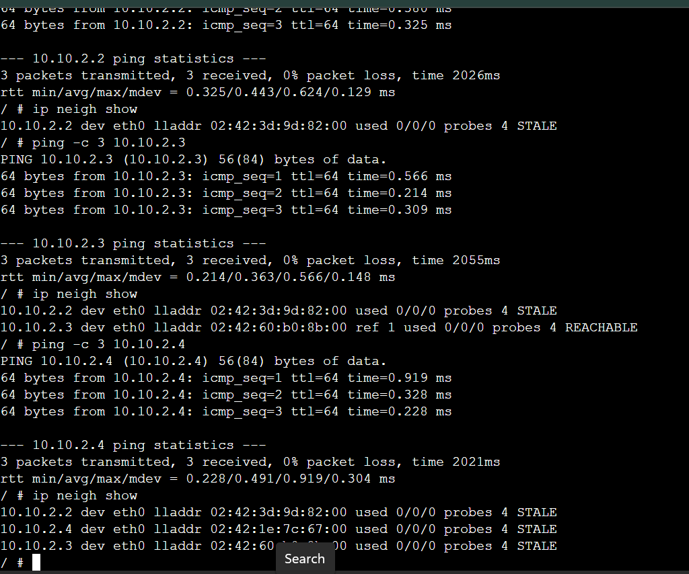
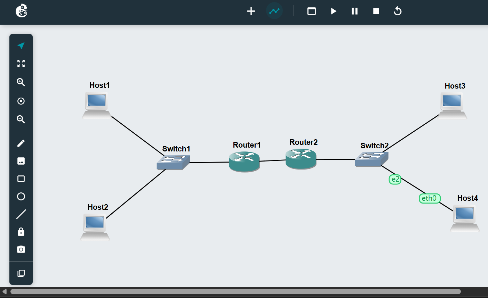
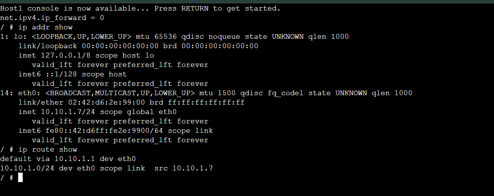
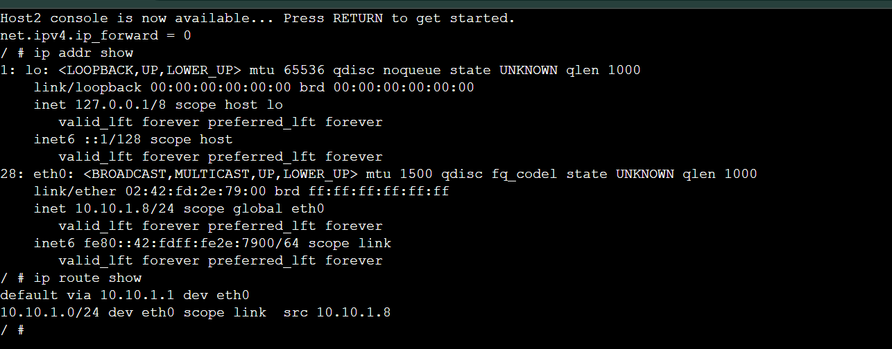
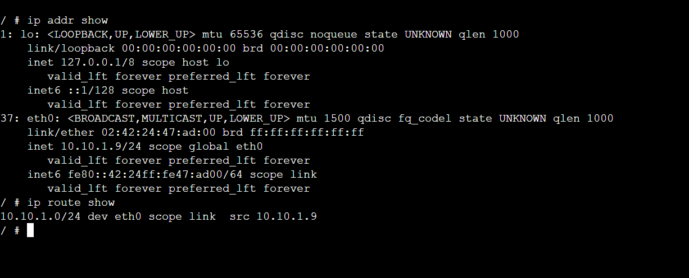
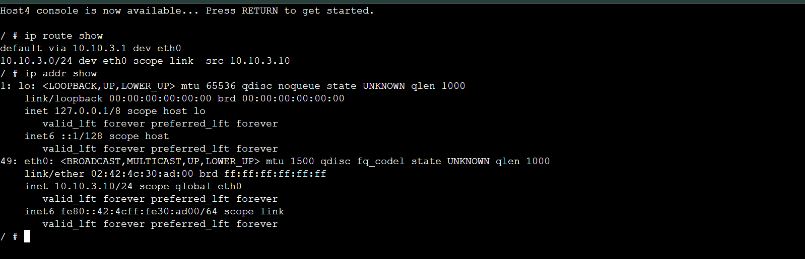
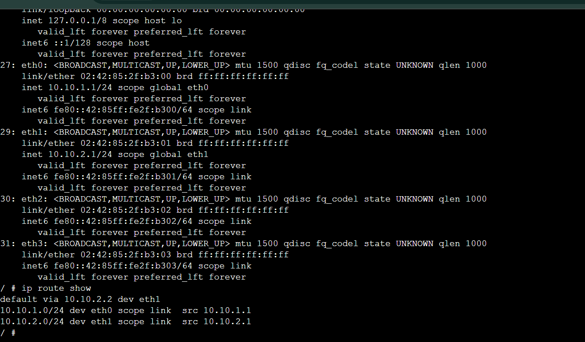
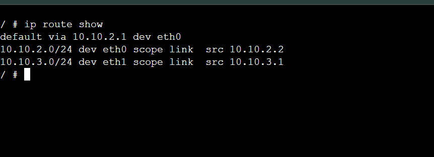
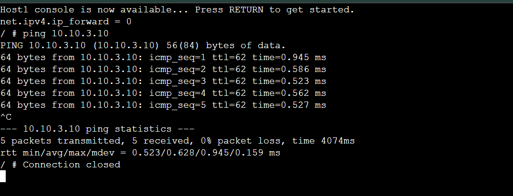

# WEEK6

1.Screenshots of ARP tables of host A at different time points that illustrate the changes in the ARP table as devices communicate:-

1.	Exported project

2.	Screenshot of the network

3.	Record of the IP addresses and routing tables of each host and router
Host 1

Host 2

  HOST 3

  HOST 4

  ROUTER 1

  ROUTER 2

4.	Screenshot of a successful ping from a host one one subnet to a host on the other subnet

